<!-- Find & replace USERNAME with your GitHub username -->

  
  
  

  
  
  
  

  

  
  

  

<picture>
  <source media="(prefers-color-scheme: dark)" srcset="https://raw.githubusercontent.com/USERNAME/USERNAME/output/snake-dark.svg"/>
  
</picture>

<code>❯ ship it, then make it pretty.</code>

